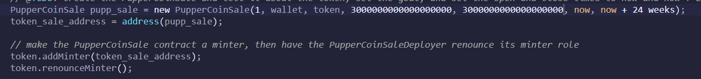

# Advanced-Solidity-Puppercoin

In this project, I will crowdsale a fictional token called Puppercoin, in order to fund network development. This network can track dog breeding activity in a decentralized manner across the globe. Owners will thereby be able to track the genetic trail of their pets.

I will create an ERC20 token that will be minted through a 'Crowdsale' contract that I will leverage from the OpenZeppelin Solidity library.

### Deployed CoinSale:

### Deployed Coin:

### Deployed the Deployer:

### Crowdsale Parameters:

* The Crowdsale will last 24 weeks.

